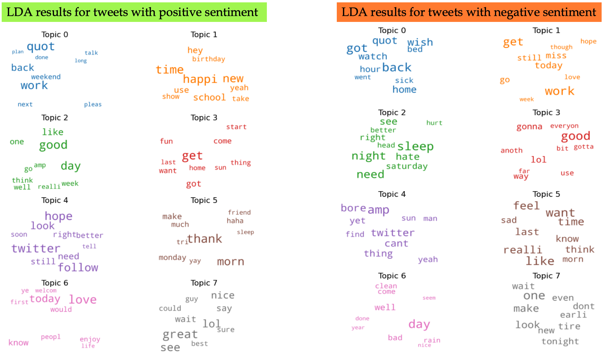

## Topic analysis using Latent Dirichlet Allocation (LDA)

This repo shows a set of Jupyter Notebooks demonstrating the technique of LDA to extract topics hidden in text data. This methids works better for long documents but we can still use it for shorter documents such as tweets. For this project I use a dataset publicy available on Kaggle. 

Following is a descrption of the dataset. 
- data contains the following 6 fields:
- target: the polarity of the tweet (0 = negative, 2 = neutral, 4 = positive)
- ids: The id of the tweet ( 2087)
- date: the date of the tweet (Sat May 16 23:58:44 UTC 2009)
- flag: The query (lyx). If there is no query, then this value is NO_QUERY.
- user: the user that tweeted (robotickilldozr)
- text: the text of the tweet (Lyx is cool)

For this analysis we will choose the text column and the target column. I choose tweets corresponding to positive target (positive sentiment). We extract topics hidden in these texts using Latent Dirichlet Allocation (LDA).
I perform similar analysis using texts with negative polarirty (negative sentiment). Finally, I visulize the results of the analysis by plotting a wordcloud.

