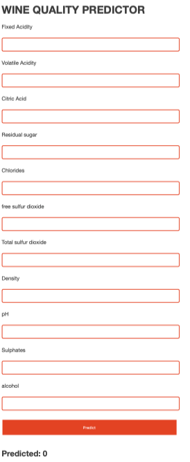

### Flask APP to predict wine quality

In this project I use a dataset from the UCI machine learning repository. The followng is a link to the dataset.

https://archive.ics.uci.edu/ml/datasets/wine+quality

Data Set Information:

The two datasets are related to red and white variants of the Portuguese "Vinho Verde" wine. For more details, consult: [Web Link] or the reference [Cortez et al., 2009]. Due to privacy and logistic issues, only physicochemical (inputs) and sensory (the output) variables are available (e.g. there is no data about grape types, wine brand, wine selling price, etc.).

These datasets can be viewed as classification or regression tasks. The classes are ordered and not balanced (e.g. there are many more normal wines than excellent or poor ones). Outlier detection algorithms could be used to detect the few excellent or poor wines. Also, we are not sure if all input variables are relevant. So it could be interesting to test feature selection methods.

Attribute Information:

For more information, read [Cortez et al., 2009]. 
Input variables (based on physicochemical tests): 
- 1 - fixed acidity 
- 2 - volatile acidity 
- 3 - citric acid 
- 4 - residual sugar 
- 5 - chlorides 
- 6 - free sulfur dioxide 
- 7 - total sulfur dioxide 
- 8 - density 
- 9 - pH 
- 10 - sulphates 
- 11 - alcohol 
Output variable (based on sensory data): 
- 12 - quality (score between 0 and 10)

For this project I use the red wine dataset. The goal is to build a machine learnig based web app that will predict wine quality based on input features. 

Following is the process used in this project.
#### Explore dataset using Jupyter notebooks. 
- notebooks/wine-pytorch.ipynb.
- There are 6 wine qualities. I classify them into 3 classes (low, mid, high). Save the data in --> input/winequality.csv
- I use 5 fold cross validation. Create the validation folds --> src/create_folds.py

#### Model data 
- To begin with, I use logistic regression and Random Forest --> src/logres.py, src/RF-wine.py.
- Then I use a neural network. 

Define network architecture --> src/network.py. 
Create pytorch dataset --> src/dataset.py
Training and evaluation scripts --> src/engine.py
Configuration --> src/config.py
Train the model --> src/train.py 
Outputs - output/ 

#### Build the flask app
- flask_app/app.py 

#### Run the flask app
- cd flask_app
- python -m app
- This will direct to a webpage where one can enter the features and get a prediction. 
